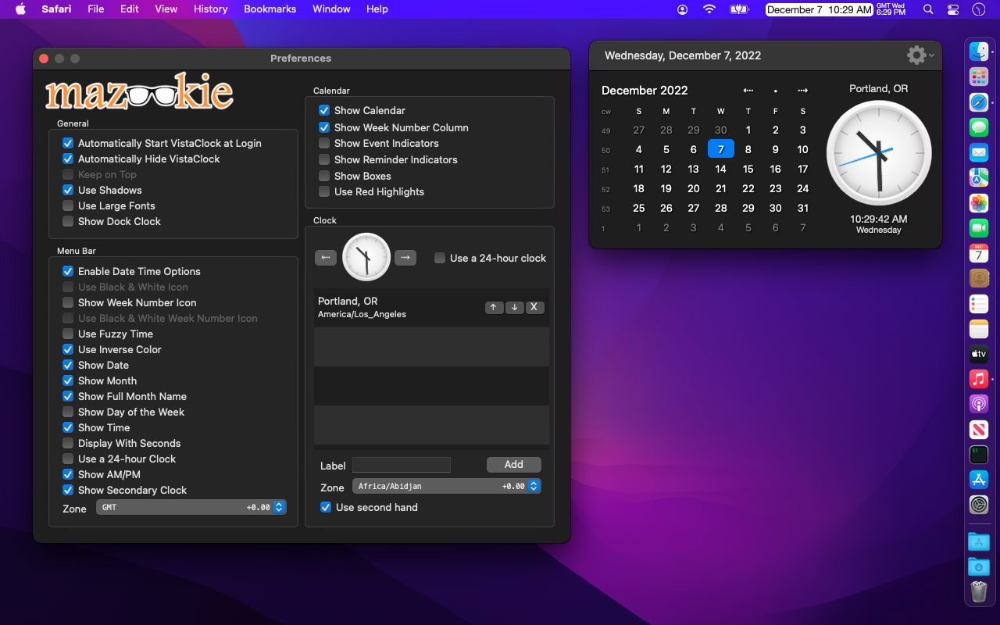

# VistaClock

VistaClock is a replacement for the Mac OSX build in menu bar clock. VistaClock not only gives you the time and optional week number icon display, but when you click on it, a dialog with calendar and analog clock opens up. Optionally you can add additional clocks with time zones. 

*** VistaClock is IANA time zone database compliant and contains all possible Time Zones.  For example, India has *one* timezone, GMT+5.5. Looking in the list delivers "Asia/Kolkata +5.5" which is indeed the correct timezone for all of India. ***

You can quickly see the date for two weeks from next thursday. Or the day the 20th of next month falls on.

Features:
- Quick access to calendar and analog clock with second hand.
- Start on Login option.
- Week Number Icon in the statusbar (color or monochrome).
- Keep on Top option.
- Additional clocks with time zone support.
- Custom format for statusbar clock.
- Custom Clock Control, choice of clock faces. 
- Custom Calendar Control. 
- Week Number calendar view.
- Automatically hides when not in focus.
- Event and Reminder indicators.
- Go to date and Day details, including day of year and offset from current day.
- Full month name for menubar date.
- Secondary time on menubar.
- Date calculator.

## Screenshots


## Versions
>[2.3.4](builds/VistaClock_v2.3.4/VistaClock.zip)
>    Changes:
>    - Old release for quick start.


## Support

**Bugs and requests?**  Please use the project's [issue tracker].

[](https://github.com/pawong/VistaClock/issues)

**Want to contribute?**  Please fork this repository and open a pull request with your new changes.

[](https://github.com/pawong/VistaClock/pulls)

**Do you like it?**  Support the project by starring the repository or [tweet] about it.

## Thanks for looking!
*If you like what you see* [](https://www.buymeacoffee.com/pawong) or don't. ```¯\_(ツ)_/¯```

**NextEvent** © 2022, Mazookie, LLC. Released under the [MIT License](LICENSE).

[tweet]: https://twitter.com/intent/tweet?
[issue tracker]: https://github.com/pawong/NextEvent/issues/new


Q: What is Mazookie?

A: Mazookie is a company that used to put apps on the MacOS App Store. This doesn't happen any more because Apple charges money to be a developer and there's no money in these apps, so the projects have been opensourced. Yeah, free stuff!
